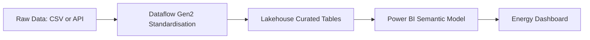

# Project 1: Energy BI & Analytics Architecture

This document outlines the architecture of the Energy BI & Analytics solution. The project demonstrates how structured, validated, and governed reporting can be delivered using Microsoft Fabric and Power BI.

---

## 1. Purpose

The goal is to model and visualise key energy-sector metrics including:

- Energy production volumes  
- CO₂ emissions  
- District heating consumption  
- Renewable vs non-renewable contributions  
- Operational KPIs  

The project showcases strong semantic modelling and reporting capabilities.

---

## 2. Data Model Architecture

The semantic model follows a star schema consisting of:

### Fact Tables

- **FactEnergyProduction**
- **FactDistrictHeating**
- **FactCO2Emissions**

### Dimension Tables

- **DimDate**  
- **DimPlant**  
- **DimEnergySource**

This structure enables:

- High performance  
- Reusable measures  
- Consistent KPI definitions  
- Scalability across business units  

---

## 3. Data Flow Architecture

---

## 4. Transformation Strategy

Fabric transformations are designed to follow a layered, scalable, and optimised pattern:

- Light transformations are implemented using Dataflows Gen2 (standardisation, basic cleansing).
- Heavy transformations and business logic are implemented in PySpark notebooks.
- Transformation outputs are written to curated Lakehouse tables.
- Incremental processing is used where applicable to improve performance and reduce compute cost.
- Schema evolution and validation rules ensure data consistency and auditability.

---

## 5. Semantic Layer

The semantic layer standardises how business metrics are defined and consumed:

- Star schema semantic models to enable performant and intuitive reporting.
- Calculation groups to centralise and standardise time-intelligence logic.
- Centralised organisational measure groups to ensure KPI consistency.
- Data validation logic applied before semantic model refresh.
- Role-Level Security (RLS) applied where appropriate to restrict sensitive data.
- Certified datasets used as “single source of truth” for enterprise reporting.

---

## 6. Deployment Architecture

Deployment is managed using Fabric’s native DevOps capabilities:

- Git integration is used for version control of semantic models, reports, Lakehouse artifacts, and pipelines.
- Deployment pipelines support a structured Dev → Test → Production flow.
- Automated validation steps ensure only approved changes move forward.
- GitHub Actions is used to orchestrate CI/CD where required.
- Workspace roles enforce environment-level separation and governance.
- Release documentation is maintained for audit and compliance.

---

## 7. Governance Considerations

The architecture aligns with enterprise-grade governance requirements:

- Workspace separation for development, testing, and production.
- Naming conventions enforce consistency across datasets, pipelines, notebooks, and reports.
- Dataset certification ensures only validated assets are used in decision-making.
- Access control implemented using RLS, OLS, and workspace permissions.
- Monitoring dashboards track pipeline runs, refresh health, usage, and capacity consumption.
- Change management processes ensure traceability and risk reduction.
- Compliance considerations include audit logs, data lineage visibility, and sensitivity labels.

---

## 8. Summary

This architecture provides a scalable, governed, and maintainable analytics foundation built on Microsoft Fabric.  
It supports:

- Reliable data ingestion  
- Enterprise-grade transformations  
- A reusable semantic layer  
- Governed reporting  
- DevOps-aligned deployment  
- Long-term adaptability for a growing analytics organisation  

It is suitable for large energy-sector enterprises that require high availability, strong governance, and consistent KPIs across multiple business units.
