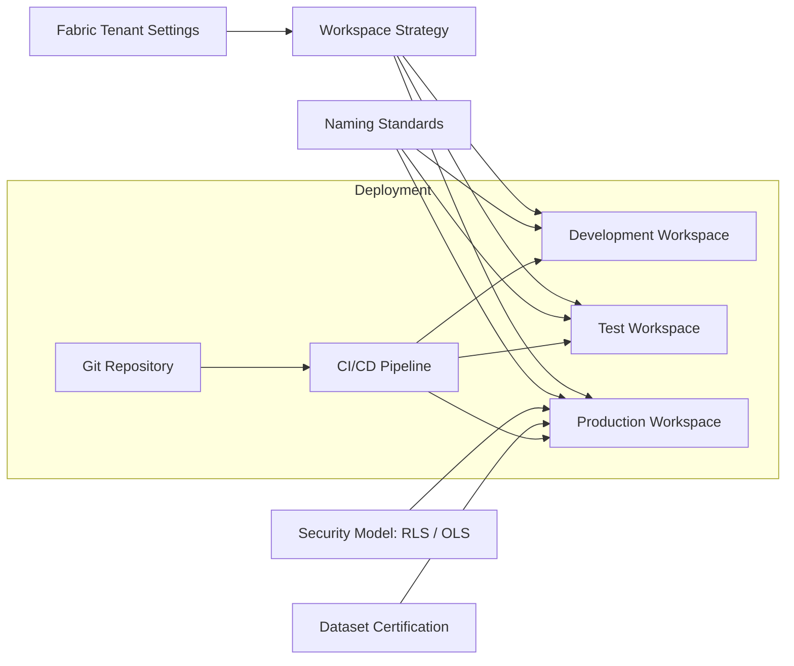

# Project 3: Fabric Governance, Security & CI/CD Architecture

This document describes the governance and operational framework required to manage Microsoft Fabric at enterprise scale. It includes workspace management, security models, naming standards, deployment processes, and monitoring.

---

## 1. Purpose

The objective of this project is to establish an enterprise-grade governance and DevOps framework for:

- Data security
- Workspace organisation
- Semantic model lifecycle management
- Deployment automation
- Access control and auditing
- Monitoring and operational oversight

This framework ensures Fabric remains compliant, scalable, and consistent across business units.

---

## 2. High-Level Governance Architecture Diagram

---

## 3. Governance Components
### 3.1 Tenant-Level Governance

- Access policies

- Capacity management

- Global settings for data movement and workloads

### 3.2 Workspace Strategy

- Clear separation of Dev, Test, Prod

- Role-based access for each environment

### 3.3 Naming Standards

- Consistent naming for datasets, reports, notebooks, pipelines, and folders

### 3.4 Dataset Governance

- Certified datasets

- Version control

- Refresh management

### 3.5 Security Model

- RLS for user-level filtering

- OLS for hiding sensitive columns

---

## 4. Operational Flow

- Developers work in Git-connected development workspaces.

- Changes are validated and promoted to Test via deployment pipelines.

- Automated tests and checks are performed.

- Approved assets move to Production.

- Monitoring captures refresh failures, pipeline errors, and dataset performance.

---

## 5. Best Practices Applied

- Principle of least privilege

- Dev/Test/Prod separation

- Automated deployments

- Data lineage visibility

- Audit-ready documentation

- Dataset certification workflow

---

## 6. Security and Compliance

- Strict role-based access control

- Sensitivity labels applied where needed

- Audit logs enabled through Fabric Admin Portal

- Governance aligned with energy-sector regulatory needs

---

## 7. Deployment and Release Process

- GitHub for version control

- GitHub Actions for CI/CD validation

- Fabric Deployment Pipelines for release flow

- Automated promotion between environments

- Manual approval gates where needed

---

## 8. Summary

This governance framework ensures Microsoft Fabric can operate securely, consistently, and at scale within a large analytical organisation. It supports compliance, reliability, and high-quality analytical delivery across teams.
