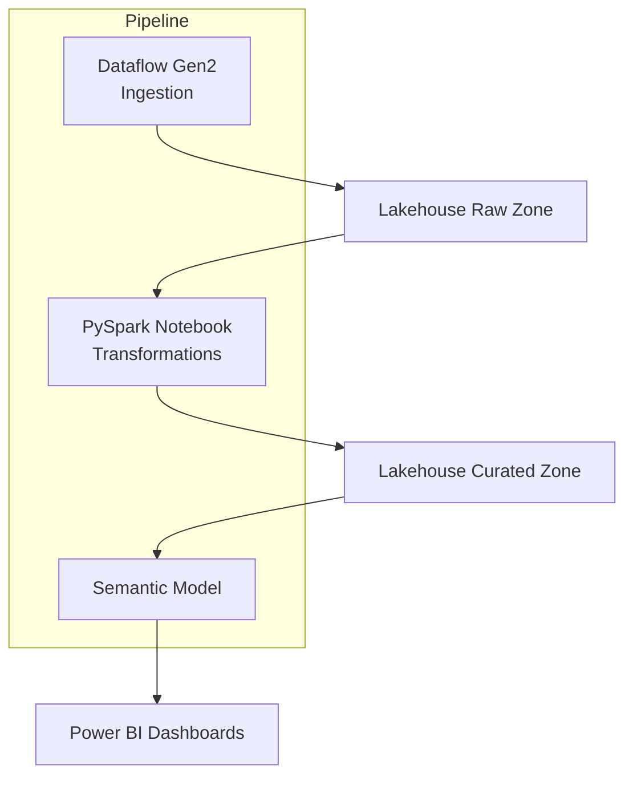

# Project 2 — Microsoft Fabric Data Engineering Pipeline

This project implements an end-to-end data engineering workflow using **Microsoft Fabric**, including ingestion, transformation, Lakehouse modelling, orchestration, and CI/CD validation.  
It demonstrates how enterprise teams can build scalable, governed data pipelines to support analytics and reporting.

---

## 1. Purpose

The purpose of this project is to:

- Ingest operational energy datasets (production, heating, emissions)
- Store them in a structured Lakehouse Raw Zone
- Transform them into curated, analysis-ready Delta tables
- Automate the workflow with Fabric Pipelines
- Refresh semantic models used by Power BI
- Validate all assets through GitHub CI/CD

This aligns with enterprise-level data engineering practices expected for a **Tech Lead** role.

---

## 2. Architecture Overview

The pipeline consists of:

- **Dataflow Gen2** for ingestion  
- **Lakehouse Raw Zone** for immutable staging  
- **PySpark Notebook** for business transformations  
- **Lakehouse Curated Zone** for cleaned and conformed Delta tables  
- **Fabric Pipeline** orchestrating the workflow  
- **Semantic Model** consumed by Power BI dashboards  
- **GitHub CI/CD** for validation and governance  

### High-Level Diagram

---

## 3. Key Files in This Project

| Component | File Path |
|----------|-----------|
| Pipeline JSON (ETL orchestration) | `/pipelines/etl_energy_pipeline.json` |
| PySpark transformation notebook | `/notebooks/transform_energy_data.py` |
| Raw & curated Lakehouse definitions | `/lakehouse/raw/` & `/lakehouse/curated/` |
| Architecture documentation | `/docs/project2_pipeline_architecture.md` |
| CI/CD documentation | `/docs/cicd_integration.md` |
| GitHub Actions workflow | `.github/workflows/fabric_ci.yml` |

These files demonstrate engineering capability, documentation maturity, and DevOps readiness.

---

## 4. How the Pipeline Works

### **Step 1 — Ingestion (Dataflow Gen2)**  
The Dataflow loads CSV files into raw Delta tables:

- raw.FactEnergyProduction
- raw.FactDistrictHeating
- raw.FactCO2Emissions
- raw.DimDate
- raw.DimPlant

### **Step 2 — Transformation (PySpark Notebook)**  
The notebook performs:

- Type cleanup and schema standardisation  
- Joining raw tables with DimDate and DimPlant  
- Creating CO₂ intensity metric  
- Calculating heating balance  
- Adding renewable energy flags  
- Writing curated Delta tables

**Resulting Curated Tables**
- curated.FactEnergyDaily  
- curated.FactHeatingDaily  
- curated.FactCO2Daily  
- curated.DimDate  
- curated.DimPlant  

### **Step 3 — Orchestration (Fabric Pipeline)**

A Fabric Pipeline automates:

1. Running the ingestion Dataflow  
2. Executing the transformation notebook 
3. Refreshing the semantic model 
 

### **Step 4 — Reporting (Power BI)**  
The semantic model powers dashboards created in **Project 1**.

### **Step 5 — CI/CD (GitHub)**  
GitHub Actions validate:

- JSON structure  
- YAML formatting  
- Python notebook syntax  

before merging to `main`.

---

## 5. Skills Demonstrated

### **Data Engineering**
- Lakehouse design  
- Delta Lake operations  
- Scalable PySpark transformations  
- Schema and data quality enforcement  

### **Platform Engineering**
- Fabric Pipelines  
- Dataflow Gen2 ingestion  
- Workspace structuring  

### **DevOps**
- GitHub CI workflows  
- Validation of artifacts  
- Promotion readiness  

### **Architecture & Documentation**
- Enterprise-standard diagrams  
- Clear modeling principles  
- Tech Lead communication  

---

## 6. Value for Enterprise (e.g., Fortum)

This data engineering pipeline enables:

- Full traceability from raw data to curated outputs  
- Production-ready ingestion and transformation logic  
- Governance through CI/CD and Git integration  
- Reusable data assets for analytics teams  
- Reliable refreshes powering business-critical dashboards  

The pipeline provides Traceability from raw ingestion to curated outputs, A repeatable and extensible transformation framework, Automated refresh processes, Early validation of repository changes, and Clean segregation between ingestion, transformation, and consumption layers.

---

## 7. Summary

Project 2 represents a complete and realistic Fabric data engineering workflow.  
It showcases ingestion, transformation, orchestration, DevOps integration, and documentation—forming the backbone of a scalable analytics platform for an energy organisation.

Together with Projects 1 and 3, it forms a full, end-to-end solution. It forms a key part of the overall analytics platform, complementing the semantic modeling in Project 1 and the governance framework in Project 3.

