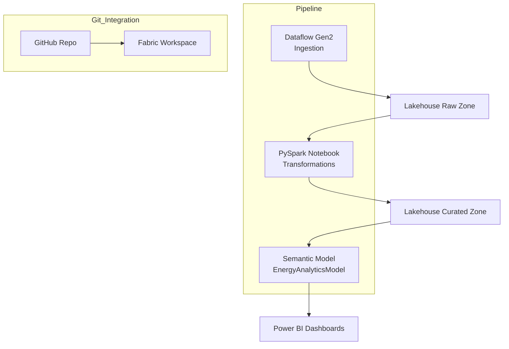

# Project 2: Fabric Pipeline Architecture (End-to-End Data Engineering)

This document outlines the end-to-end architecture for ingesting, transforming, and publishing analytics-ready data using Microsoft Fabric. It represents a production-aligned pattern suitable for enterprise energy analytics.

## 1. Purpose

The pipeline is designed to:

- Ingest raw operational datasets for energy production, heating, and emissions

- Store raw data in an immutable Lakehouse Raw Zone

- Perform validated, scalable PySpark transformations

- Produce curated Delta tables for reporting

- Trigger semantic model refreshes

- Provide a blueprint for DevOps-driven Fabric workflows

This directly supports Fortum’s goal of creating reusable, governed data products.

---

## 2. High-Level Architecture Diagram



---

## 3. Components Overview
### 3.1 Dataflow Gen2 (Ingestion Layer)

- Loads CSV files into Raw Zone

- Handles schema enforcement

- Can be replaced by API or event streaming later

### 3.2 Lakehouse Raw Zone

- Stores raw, unmodified Delta tables

- Enables auditability and reprocessing

- Acts as single source of truth for ingestion

### 3.3 PySpark Transformation Notebook

- Cleans and standardises raw tables

- Joins DimDate and DimPlant

- Computes CO₂ intensity & heating balance

- Writes optimised curated tables

### 3.4 Lakehouse Curated Zone

- Domain-ready Delta tables

- Supports semantic model consumption

- Clear separation between ingestion and business logic

### 3.5 Semantic Model

- Direct Lake or Import

- Contains enterprise KPIs

- Used by Power BI dashboards

### 3.6 Fabric Pipeline

- Orchestrates ingestion → transformation → model refresh

- Provides monitoring and scheduling

---

## 4. Process Flow

- Dataflow Gen2 loads CSVs into ```raw.*``` tables

- Notebook reads raw tables, validates data, applies transformations

- Notebook writes curated tables into ```curated.*```

- Pipeline triggers semantic model refresh

- Power BI dashboards update automatically

- All assets tracked in GitHub for version control

---

## 5. Best Practices Applied

- Raw → Curated separation

- Delta format for performance & ACID guarantees

- Time-series optimisations for energy data

- Reusable DimDate & DimPlant

- Notebook modularity and code clarity

- Naming conventions aligned with enterprise standards

- Lineage visibility across the stack

---

## 6. Security & Access Control

- Workspace-level roles limit access to raw/curated zones

- Sensitive emission tables governed via RLS in semantic model

- Git-backed audit trail for all changes

- Controlled deployment of pipelines

---

## 7. Deployment Approach

- Fabric Git Integration links workspace to GitHub

- Notebook, Dataflows, Pipelines synchronised via Git

- CI/CD pipelines automate semantic model validation

- Deployment Pipelines simulate Dev → Test → Prod

- Versioning ensures safe rollbacks

---

## 8. Summary

Project 2 provides a complete, production-aligned data engineering workflow for Microsoft Fabric.
It demonstrates:

- Data ingestion

- Transformation engineering

- Lakehouse modelling

- Orchestration

- CI/CD readiness

This is the foundation of a scalable analytics platform.
