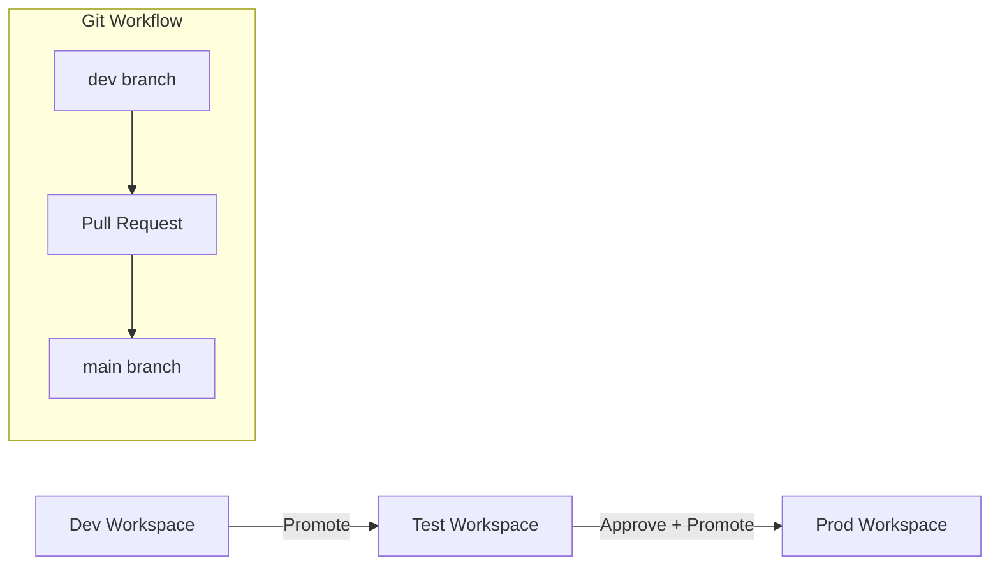

# Fabric Deployment Pipeline (Dev → Test → Prod)

This document describes the promotion process for Fabric assets using Deployment Pipelines and GitHub integration.

---

## 1. Purpose

- Ensure safe deployment of Fabric artifacts
- Enforce quality checks
- Provide traceability between environments
- Support incremental delivery

---

## 2. Architecture Overview

---

## 3. Pipeline Stages

### **Stage 1: Development**
Engineers develop:
- Dataflows  
- Notebooks  
- Pipelines  
- Semantic models  

GitHub sync ensures versioning.

### **Stage 2: Test**
Automated smoke tests:
- Pipeline run  
- Schema checks  
- Data volume checks  
- Model refresh  

### **Stage 3: Production**
Manual approval required.  
Promotion triggers:
- Prod model refresh  
- Operational monitoring

---

## 4. Validation Checklist

Before promotion:
- Notebook executes successfully  
- Pipeline runs end-to-end  
- No schema mismatches  
- Approval recorded in GitHub PR  
- All CI checks pass  

---

## 5. Summary

This deployment pipeline ensures safe, validated progression of Fabric assets from development to production, with GitHub providing traceability and control.
